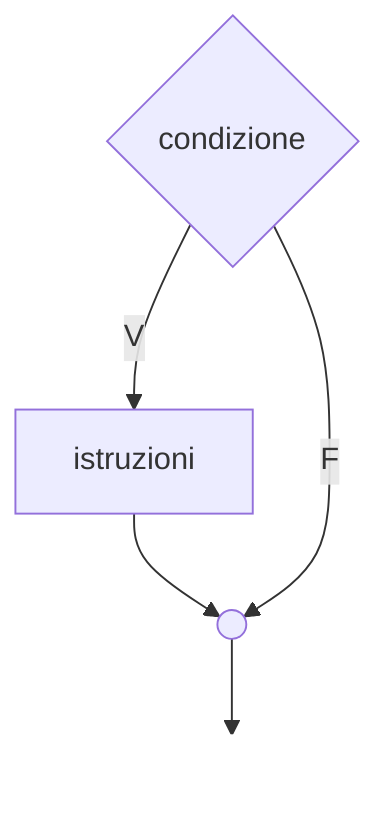
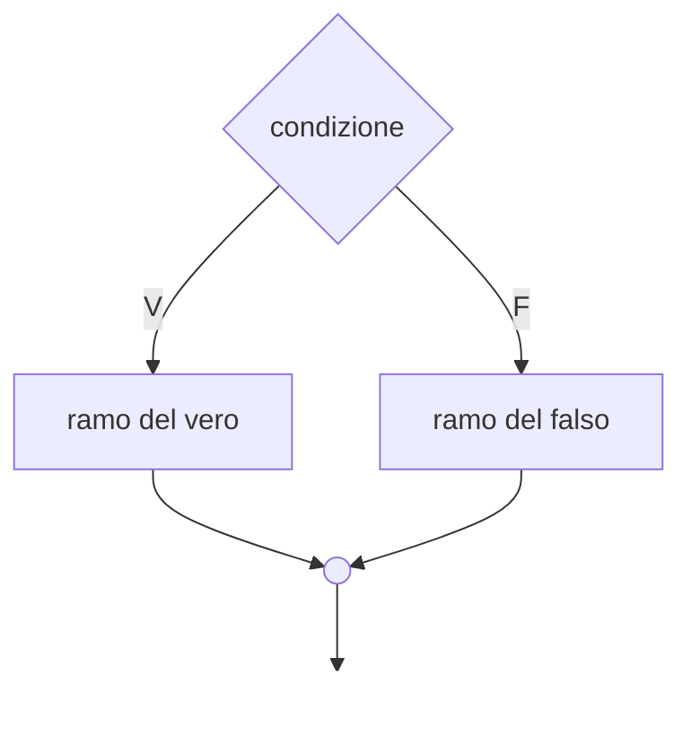
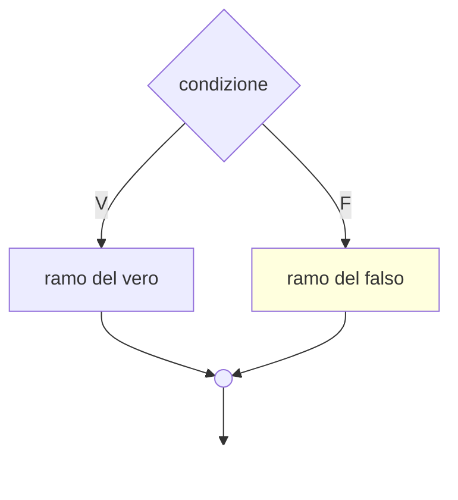
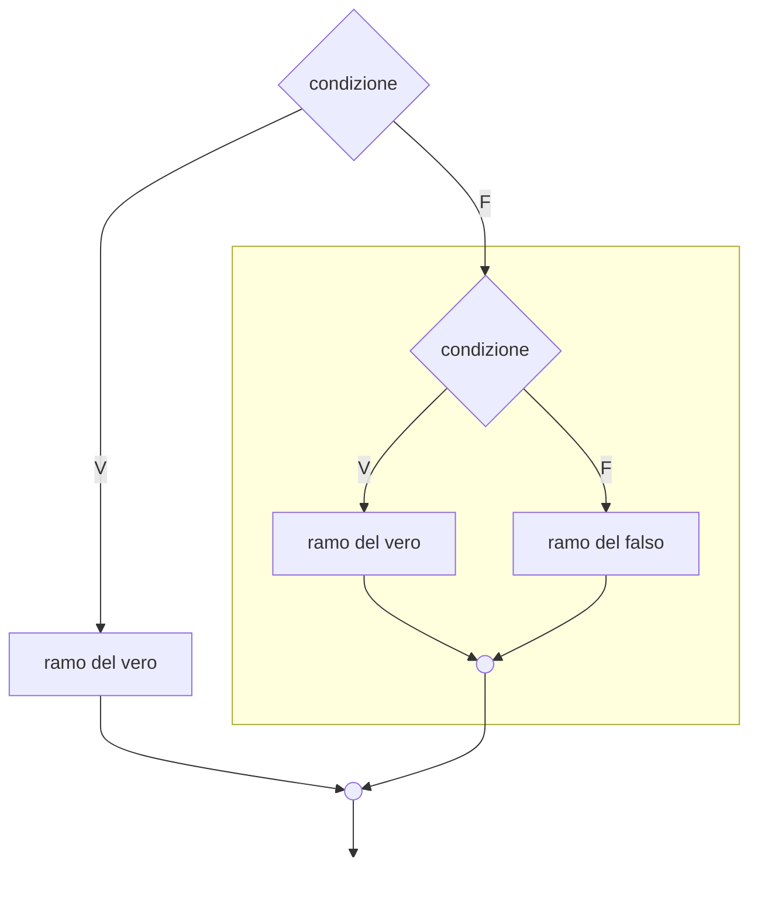

# La selezione in C

---

# Sommario

- La selezione semplice
- Operatori relazionali
- La selezione binaria
- Operatori logici
- La selezione nidificata
- L'istruzione switch

---
layout: section
---

# Selezione semplice

---

# La selezione semplice

<div class="flex">
<div class="basis-1/2 text-center">

</div>
<div class="basis-1/2">

  Il calcolatore esegue alcune istruzioni sulla base di una **condizione logica**.

  Se la **condizione** risulta **VERA**, vengono eseguite alcune istruzioni.

  Se la **condizione** risulta **FALSA**, non viene eseguita alcuna istruzione.
</div>
</div>

---

# La selezione semplice in C

```c {monaco}
if(condizione)
{
  istruzione 1;
  istruzione 2;
  ....
  istruzione N;
}
```
---

# Operatori relazionali

Una condizione è un'espressione del linguaggio rappresentata da due elementi messi a confronto da un operatore relazionale.

<div>
    <table style="text-align: center " class="table-auto border-spacing-4">
      <thead class="bg-indigo-500 text-white">
        <tr>
          <th style="text-align: center ">Operatore</th>
          <th style="text-align: center ">Esempio</th>
          <th style="text-align: center ">Significato</th>
        </tr>
      </thead>
      <tbody>
        <tr>
          <td class="font-semibold" style="text-align: center"> &gt </td>
          <td>a &gt b</td>
          <td>maggiore</td>
        </tr>
        <tr>
          <td class="font-semibold">&lt</td>
          <td>a &lt b</td>
          <td>minore</td>
        </tr>
        <tr>
          <td class="font-semibold">&gt=</td>
          <td>a &gt= b</td>
          <td>maggiore uguale</td>
        </tr>
        <tr>
          <td class="font-semibold">&lt=</td>
          <td>a &lt= b</td>
          <td>minore uguale</td>
        </tr>
        <tr>
          <td class="font-semibold">==</td>
          <td>a == b</td>
          <td>uguale</td>
        </tr>
        <tr>
          <td class="font-semibold">!=</td>
          <td>a != b</td>
          <td>diverso</td>
        </tr>
      </tbody>
    </table>
</div>

---

# Errore tipico

Un errore diffuso è quello di utilizzare l'operatore = **(operatore di assegnazione)** per effettuare un confronto.
Occorre invece usare l'**operatore == (operatore di confronto)**.

<div class="flex">
  <div class="basis-1/2">

```c  {monaco}
...
if(a = b)
{
  // do something
}
```
</div>
<div class="basis-1/2">
  <ul style="list-style: none;" class="mx-8">
    <li>❌ Sbagliato</li>
  </ul>
</div>
</div>

<div class="flex">
  <div class="basis-1/2">

```c  {monaco}
...
if(a == b)
{
  // do something
}
```
</div>
<div class="basis-1/2">
  <ul style="list-style: none;" class="mx-8">
    <li>✅ Corretto</li>
  </ul>
</div>
</div>

---
clicks: 5
---

# Valore assoluto

<div class="flex">
  <div class="basis-1/2">

```c {all|5,7,8|9|9-12|13|all}
#include <stdio.h>

int main(void) 
{
  int num;

  printf("Inserire un numero\n");
  scanf("%d", &num);
  if(num < 0)
  {
    num = num * -1;
  }
  printf("Valore assoluto del numero: %d \n", num);

  return 0;
}
```
</div>
<div class="basis-1/2">
  <ul style="list-style: none;" class="mx-8">
    <li v-click="2">num = -3</li>
    <li v-click="3">condizione <strong>VERA</strong></li>
  </ul>
</div>
</div>

---
clicks: 5
---

# Valore assoluto

<div class="flex">
  <div class="basis-1/2">

```c {all|5,7,8|9|13|all}
#include <stdio.h>

int main(void) 
{
  int num;

  printf("Inserire un numero\n");
  scanf("%d", &num);
  if(num < 0)
  {
    num = num * -1;
  }
  printf("Valore assoluto del numero: %d \n", num);

  return 0;
}
```
</div>
<div class="basis-1/2">
  <ul style="list-style: none;" class="mx-8">
    <li v-click="2">num = 5</li>
    <li v-click="3">condizione <strong>FALSA</strong></li>
  </ul>
</div>
</div>

---
clicks: 2
---

# Calcolo budget

<div class="flex">
<div class="basis-1/2">

```c {all|17-18|all}
#include <stdio.h>

int main(void) 
{
  float scarpe, maglietta, pantaloni;
  float budget;

  printf("Inserire prezzo scarpe:\n");
  scanf("%f", &scarpe);
  printf("Inserire prezzo maglietta:\n");
  scanf("%f", &maglietta);
  printf("Inserire prezzo pantaloni:\n");
  scanf("%f", &pantaloni);

  budget = scarpe + maglietta + pantaloni;

  if(budget > 200)
    printf("Budget superato!\n");

  printf("Totale: %f", budget);

  return 0;
}
```
</div>
<div class="basis-1/2">
<ul style="list-style: none;" class="mx-8">
    <li v-click="1">✅ Se in un ramo è presente una singola istruzione, è possibile omettere le parentesi graffe.</li>
     <li v-click="1">❗️ Attenzione! Occorre indentare il codice per una maggiore leggibilità</li>
</ul>
</div>
</div>

---
clicks: 0
---

# Ordinamento di tre variabili


```c {all} {maxHeight:'400px'}

#include <stdio.h>

int main(void) 
{
  int num1, num2, num3, min, med, max, temp;

  printf("Inserire num1:\n");
  scanf("%d", &num1);
  printf("Inserire num2:\n");
  scanf("%d", &num2);
  printf("Inserire num3:\n");
  scanf("%d", &num3);
  
  max = num1;
  min = num2;
  med = num3;

  if(min > max)
  {
    temp = min;
    min = max;
    max = temp;
  }

  if(med > max)
  {
    temp = med;
    med = max;
    max = temp;
  }

  if(med < min)
  {
    temp = med;
    med = min;
    min = temp;
  }

  printf("Numeri ordinati: %d %d %d\n", min, med, max);
  
  return 0;
}

```
---
layout: section
---

# Selezione binaria

---

# La selezione binaria

<div class="flex">
<div class="basis-1/2 text-center">

</div>
<div class="basis-1/2">

  Il calcolatore esegue <strong>alternativamente</strong> alcune istruzioni sulla base di una **condizione logica**.

  Se la **condizione** risulta **VERA**, vengono eseguite le istruzioni del ramo del vero.

  Se la **condizione** risulta **FALSA**, vengono eseguite le istruzioni del ramo del falso.
</div>
</div>

---

# La selezione binaria in C

```c {monaco}
if(condizione)
{
  istruzione x;
  istruzione y;
  ....
  istruzione z;
}
else
{
  istruzione j;
  istruzione k;
  ....
  istruzione m;
}
```
---
clicks: 5
---
# Numero positivo o negativo

<div class="flex">
  <div class="basis-1/2">

```c {all|5,7,8|10|10-13|19|all}
#include <stdio.h>

int main(void) 
{
  int num;
  
  printf("Inserire numero:\n");
  scanf("%d", &num);

  if(num > 0)
  {
    printf("Numero positivo!\n");
  }
  else
  {
    printf("Numero negativo!\n");
  }
  
  return 0;
}
```
</div>
<div class="basis-1/2">
  <ul style="list-style: none;" class="mx-8">
    <li v-click="2">num = 5</li>
    <li v-click="3">condizione <strong>VERA</strong></li>
  </ul>
</div>
</div>

---
clicks: 5
---
# Numero positivo o negativo

<div class="flex">
  <div class="basis-1/2">

```c {all|5,7,8|10|14-17|19|all}
#include <stdio.h>

int main(void) 
{
  int num;
  
  printf("Inserire numero:\n");
  scanf("%d", &num);

  if(num > 0)
  {
    printf("Numero positivo!\n");
  }
  else
  {
    printf("Numero negativo!\n");
  }
  
  return 0;
}
```
</div>
<div class="basis-1/2">
  <ul style="list-style: none;" class="mx-8">
    <li v-click="2">num = -3</li>
    <li v-click="3">condizione <strong>FALSA</strong></li>
  </ul>
</div>
</div>

---
clicks: 2
---

# Pari o dispari

<div class="flex">
<div class="basis-1/2">

```c {all|10-13|all}
#include <stdio.h>

int main(void) 
{
  int num;
  
  printf("Inserire numero:\n");
  scanf("%d", &num);

  if(num % 2 == 0)
    printf("Numero pari!\n");
  else
    printf("Numero dispari!\n");
  
  return 0;
}
```
</div>
<div class="basis-1/2">
<ul style="list-style: none;" class="mx-8">
    <li v-click="1">✅ Se in un ramo è presente una singola istruzione, è possibile omettere le parentesi graffe.</li>
     <li v-click="1">❗️ Attenzione! Occorre indentare il codice per una maggiore leggibilità</li>
</ul>
</div>
</div>

---

# Ordinare due numeri (usando min e max)

```c {all} {maxHeight:'400px'}
#include <stdio.h>

int main(void) 
{
  float a, b, min, max;

  printf("Inserire a:\n");
  scanf("%f", &a);
  printf("Inserire b:\n");
  scanf("%f", &b);

  if (a > b) 
  {
    max = a;
    min = b;
  } 
  else 
  {
    max = b;
    min = a;
  }

  printf("Il minimo: %f\n", min);
  printf("Il massimo: %f\n", max);
  return 0;
}
```

---

# Operatori logici

Fino ad ora sono state trattate condizioni logiche semplici.

Una condizione logica composta è un insieme di condizioni logiche semplici legati da **operatori logici**.

Esempio:

<div class="flex">
  <div class="basis-1/3">
  </div>
  <div class="basis-1/3">
    <div class="border-3 border-indigo-500 w-300px text-center">
      <h2> <span class="text-teal-500">(x &gt= 3)</span> <span class="text-red-500">&&</span> <span class="text-amber-500">(y &lt= 5)</span> </h2>
    </div>
    
  </div>
  <div class="basis-1/3">
    <div class="text-indigo-500 w-300px text-center">
      <h4> condizione composta </h4>
    </div>
  </div>
</div>


<div class="flex justify-center">
  <div class="text-red-500 w-300px text-center py-2">
      <h4> operatore logico </h4>
    </div>
</div>

<div class="flex justify-center">
  <div class="text-teal-500 w-300px text-center">
    <h4> condizione A </h4>
  </div>
  <div class="text-amber-500 w-300px text-center">
    <h4> condizione B </h4>
  </div>
</div>

---

# Operatori logici

<div class="py-8">
    <table style="text-align: center " class="table-auto border-spacing-4">
      <thead class="bg-indigo-500 text-white">
        <tr>
          <th style="text-align: center ">Operatore</th>
          <th style="text-align: center ">Esempio</th>
          <th style="text-align: center ">Significato</th>
        </tr>
      </thead>
      <tbody>
        <tr>
          <td class="font-semibold" style="text-align: center"> && </td>
          <td>a && b</td>
          <td>AND (Prodotto logico)</td>
        </tr>
        <tr>
          <td class="font-semibold"> || </td>
          <td>a || b</td>
          <td>OR (Somma logica)</td>
        </tr>
        <tr>
          <td class="font-semibold"> ! </td>
          <td>!a</td>
          <td>NOT (Negazione)</td>
        </tr>
      </tbody>
    </table>
</div>

<div style="text-align: center">
  L'operatore NOT (!) in realtà non mette in relazione due o più condizioni semplici.  
</div>

---

# AND (Prodotto logico)


<div class="flex">
  <div class="basis-1/2 py-10 pr-8  ">
    <p> L’espressione logica A && B è <span class="text-red-500">VERA se e solo se entrambe le condizioni A e B sono VERE</span>.</p>
  </div>
  <div class="basis-1/2">
    <table style="text-align: center " class="table-auto border-spacing-4">
      <thead class="bg-indigo-500 text-white">
        <tr>
          <th style="text-align: center ">A</th>
          <th style="text-align: center ">B</th>
          <th style="text-align: center ">A && B</th>
        </tr>
      </thead>
      <tbody>
        <tr>
          <td> F </td>
          <td> F </td>
          <td class="font-bold">F</td>
        </tr>
        <tr>
          <td> F </td>
          <td> V </td>
          <td class="font-bold">F</td>
        </tr>
        <tr>
          <td> V </td>
          <td> F </td>
          <td class="font-bold">F</td>
        </tr>
        <tr>
          <td> V </td>
          <td> V </td>
          <td class="font-bold text-red-500">V</td>
        </tr>
      </tbody>
    </table>
  </div>
</div>

---

# AND (Prodotto logico)


<div class="flex py-10">
  <div class="basis-1/2">
  
  ```c
#include <stdio.h>

int main(void) 
{
    int eta;
    printf("Inserire età:\n");
    scanf("%d", &eta);

    if ((eta > 2) && (eta < 90))
      printf("Costo ingresso: 8 euro.\n");
    else
      printf("Ingresso gratuito\n");
    
    return 0;
}
  ```
  </div>
  <div class="basis-1/2 px-10">
    <p >
      Il ramo del VERO sarà eseguito se il valore della variabile <code>eta</code> soddisferà contemporaneamente entrambe le condizioni.
    </p>
  </div>
</div>

---

# OR (Somma logica)


<div class="flex">
  <div class="basis-1/2 py-10 pr-8">
    <p> L’espressione logica A || B è <span class="text-red-500">VERA se e solo se almeno una delle condizioni A oppure B sono VERE</span>.</p>
  </div>
  <div class="basis-1/2">
    <table style="text-align: center " class="table-auto border-spacing-4">
      <thead class="bg-indigo-500 text-white">
        <tr>
          <th style="text-align: center ">A</th>
          <th style="text-align: center ">B</th>
          <th style="text-align: center ">A || B</th>
        </tr>
      </thead>
      <tbody>
        <tr>
          <td> F </td>
          <td> F </td>
          <td class="font-bold">F</td>
        </tr>
        <tr>
          <td> F </td>
          <td> V </td>
          <td class="font-bold text-red-500">V</td>
        </tr>
        <tr>
          <td> V </td>
          <td> F </td>
          <td class="font-bold text-red-500">V</td>
        </tr>
        <tr>
          <td> V </td>
          <td> V </td>
          <td class="font-bold text-red-500">V</td>
        </tr>
      </tbody>
    </table>
  </div>
</div>

---

    
# OR (Somma logica)


<div class="flex py-10">
  <div class="basis-1/2">
  
  ```c
#include <stdio.h>

int main(void) 
{
    int eta;
    printf("Inserire età:\n");
    scanf("%d", &eta);

    if ((eta < 2) || (eta > 90))
      printf("Ingresso gratuito\n");
    else
      printf("Costo ingresso: 8 euro.\n");
    
    return 0;
}
  ```
  </div>
  <div class="basis-1/2 px-10">
    <p >
      Il ramo del VERO sarà eseguito se il valore della variabile <code>eta</code> soddisferà almeno una delle condizioni.
    </p>
  </div>
</div>

---

# Vero e Falso in C

Nei linguaggi moderni, oltre ai tipi di dato int, float, char, .... , esiste anche il tipo bool.

Il tipo di dato `bool` consente di creare variabili in grado di assumere solamente due valori: VERO o FALSO.

Nel linguaggio C non esiste il tipo `bool`, ma è comunque possibile esprimere il concetto di VERO o FALSO.

Infatti, una condizione è:
- VERA (true) se assume valore diverso da 0
- FALSA (false) se assume valore uguale a 0

---
clicks: 2
---

# Vero e Falso in C


<div class="flex">
<div class="basis-1/2">

```c {all|5,7,8|12}
#include <stdio.h>

int main(void) 
{
  int condizione = 1;

  if(condizione)
    printf("ramo del vero\n");
  else
    printf("ramo del falso\n");

  return 0;
}
```
</div>
  <div class="basis-1/2 px-10">
    <p >
      Siccome la variabile <code>condizione = 1</code>, il suo valore sarà VERO.
    </p>
  </div>
</div>

---
clicks: 2
---

# Vero e Falso in C


<div class="flex">
<div class="basis-1/2">

```c {all|5,7,9,10|12}
#include <stdio.h>

int main(void) 
{
  int condizione = 0;

  if(condizione)
    printf("ramo del vero\n");
  else
    printf("ramo del falso\n");

  return 0;
}
```
</div>
  <div class="basis-1/2 px-10">
    <p >
      Siccome la variabile <code>condizione = 0</code>, il suo valore sarà FALSO.
    </p>
  </div>
</div>

---

# NOT (Negazione)

<div class="flex">
  <div class="basis-1/2 py-10 pr-8">
    <p> L’espressione logica !A esegue il cambiamento del valore di verità assunto dalla condizione:<span class="text-red-500"> se l'enunciato era VERO, negandolo diventa FALSO e viceversa</span>.</p>
  </div>
  <div class="basis-1/2">
    <table style="text-align: center " class="table-auto border-spacing-4">
      <thead class="bg-indigo-500 text-white">
        <tr>
          <th style="text-align: center ">A</th>
          <th style="text-align: center ">!A</th>
        </tr>
      </thead>
      <tbody>
        <tr>
          <td> F </td>
          <td class="font-bold text-red-500">V</td>
        </tr>
        <tr>
          <td> V </td>
          <td class="font-bold">F</td>
        </tr>
      </tbody>
    </table>
  </div>
</div>

---
layout: section
---

# Selezione nidificata

---

# La selezione nidificata

<div class="flex">
  <div class="basis-1/2">


  </div>
  <div class="basis-1/2">
  <p>I rami della selezione possono contenere qualsiasi tipo di codice:</p>

```c {monaco}
  if(condizione)
  {
    ....
  }
  else
  {
    ...
  }
```
  </div>
</div>


---

# La selezione nidificata

<div class="flex">
    <div class="basis-1/2">


  </div>
  <div class="basis-1/2">
    <p>Il ramo del falso contiene un'altra selezione binaria.</p>
    <p>Questa situazione si chiama selezione nidificata.</p>
  </div>
</div>


---

# La selezione nidificata in C

```c {monaco}
if(condizione)
{
  istruzione x;
  istruzione y;
  istruzione z;
}
else
{
  if(condizione)
  {
    istruzione j;
    istruzione k;
    istruzione l;
  }
  else
  {
    istruzione m;
    istruzione n;
    istruzione o;
  }
}
```
---

# Maggiore, minore, uguale

Verificare se due numeri sono uguali, maggiore di..., minore di....

```c {all} {maxHeight:'400px'}
#include <stdio.h>

int main(void) 
{
  int num1, num2;

  printf("Inserire num1:\n");
  scanf("%d", &num1);
  printf("Inserire num2:\n");
  scanf("%d", &num2);

  if(num1 == num2)
  {
    printf("I due numeri sono uguali\n"); 
  }
  else
  {
    if(num1 > num2)
    {
      printf("num1 > num2\n");
    }
    else
    {
      printf("num1 < num2\n");
    }
  }
    
  return 0;
}
```

---

# Temperature

<div class="flex">
  <div class="basis-1/2">

```c {all} {maxHeight:'400px'}
#include <stdio.h>

int main(void) 
{
  int t;

  printf("Inserire temperatura:\n");
  scanf("%d", &t);

  if(t > 30)
  {
    printf("molto caldo!\n");
  }
  else
  {
    if(t > 20)
    {
      printf("caldo!\n");
    }
    else
    {
      if(t > 10)
      {
        printf("ideale\n");
      }
      else
      {
        printf("freddo\n");
      }
    }
  }
    
  return 0;
}
```
  </div>
  <div class="basis-1/2 px-6">
  <table style="text-align: center " class="table-auto border-spacing-4">
      <thead class="bg-indigo-500 text-white">
        <tr>
          <th style="text-align: center ">Temperatura</th>
          <th style="text-align: center ">Messaggio</th>
        </tr>
      </thead>
      <tbody>
        <tr>
          <td> t &gt 30 </td>
          <td > molto caldo </td>
        </tr>
        <tr>
          <td> 20 &lt t &lt 30 </td>
          <td > caldo </td>
        </tr>
        <tr>
          <td> 10 &lt t &lt 20 </td>
          <td > ideale </td>
        </tr>
        <tr>
          <td> 0 &lt t &lt 10 </td>
          <td > freddo </td>
        </tr>
      </tbody>
    </table>
  </div>
</div>

---

# Temperature (else - if)

<div class="flex">
  <div class="basis-1/2">

```c {all} {maxHeight:'400px'}
#include <stdio.h>

int main(void) 
{
  int t;

  printf("Inserire temperatura:\n");
  scanf("%d", &t);

  if(t > 30)
  {
    printf("molto caldo!\n");
  }
  else if(t > 20)
  {
    printf("caldo!\n");
  }
  else if(t > 10)
  {
    printf("ideale\n");
  }
  else
  {
    printf("freddo\n");
  }

  return 0;
}
```
  </div>
  <div class="basis-1/2 px-6">
  <table style="text-align: center " class="table-auto border-spacing-4">
      <thead class="bg-indigo-500 text-white">
        <tr>
          <th style="text-align: center ">Temperatura</th>
          <th style="text-align: center ">Messaggio</th>
        </tr>
      </thead>
      <tbody>
        <tr>
          <td> t &gt 30 </td>
          <td > molto caldo </td>
        </tr>
        <tr>
          <td> 20 &lt t &lt 30 </td>
          <td > caldo </td>
        </tr>
        <tr>
          <td> 10 &lt t &lt 20 </td>
          <td > ideale </td>
        </tr>
        <tr>
          <td> 0 &lt t &lt 10 </td>
          <td > freddo </td>
        </tr>
      </tbody>
    </table>
  </div>
</div>

---

# Equazione di II grado

Un'equazione di secondo grado ha la seguente forma:

<br>

$$

ax^2+bx+c=0

$$
le cui radici sono:
$$

  x_1, x_2 = \frac{ -b \pm \sqrt{\Delta} } {2a} \ \ \ \textrm{con} \ \ \ \Delta = b^2 - 4ac

$$

<br>
<hr>
<div class="flex text-center">
<div class="basis-1/3">
    <p>impossibile</p>

  $$

    \Delta < 0

  $$

</div>
  <div class="basis-1/3">
    <p>radici coincidenti</p>

  $$

    \Delta = 0

  $$
  </div>
  <div class="basis-1/3">
    <p>radici distinte</p>

  $$

    \Delta > 0

  $$
  </div>
</div>


---

# Equazione di II grado

```c {all} {maxHeight:'400px'}
#include <stdio.h>
#include <math.h>

int main(void) 
{
  float a, b, c, delta, x1, x2;

  printf("Equazione di II grado\n");
  printf("Inserire a:\n");
  scanf("%f", &a);
  printf("Inserire b:\n");
  scanf("%f", &b);
  printf("Inserire c:\n");
  scanf("%f", &c);

  if(a == 0)
    printf("Equazione di primo grado. Formula inutilizzabile\n");
  else
  {
    delta = b*b - 4*a*c;
    
    if(delta < 0)
      printf("Delta negativo: impossibile!\n");
    else if(delta > 0)
    {
      x1 = (-b - sqrt(delta)) / (2*a);
      x2 = (-b + sqrt(delta)) / (2*a);

      printf("Delta positivo: radici distinte!\n");
      printf("x1: %.3f\n", x1);
      printf("x2: %.3f\n", x2);
    }
    else
    {
      x1 = -b / (2*a);
      printf("Delta nullo: radici coincidenti!\n");
      printf("x1,x2: %.3f\n", x1);
    }
  }
    
  return 0;
}
```
---

# Calcolo di min, med e max

```c {all} {maxHeight:'400px'}
#include <stdio.h>

int main(void) 
{
  int n1, n2, n3, min, med, max;

  printf("Inserire n1:\n");
  scanf("%d", &n1);
  printf("Inserire n2:\n");
  scanf("%d", &n2);
  printf("Inserire n3:\n");
  scanf("%d", &n3);

  if(n1 > n2)
  {
    max = n1;
    min = n2;
  }
  else
  {
    max = n2;
    min = n1;
  }

  if(n3 < min)
  {
    med = min;
    min = n3;
  }
  else if(n3 > max)
  {
    med = max;
    max = n3;
  }
  else
    med = n3;

  printf("min: %d\n", min);
  printf("med: %d\n", med);
  printf("max: %d\n", max);
  
  return 0;
}
```
---

# Dandlig else

Analizziamo il seguente codice:

<div class="flex space-x-8">
  <div class="basis-1/2">

```c {monaco}
#include <stdio.h>

int main(void) 
{
  int x = 11;
  int y = 9;

  if(x<10)
    if(y>10)
      printf("*****");
  else
    printf("#####");
    printf("$$$$$");

  return 0;
}
```
  </div>
  <div class="basis-1/2">

```c {monaco}
#include <stdio.h>

int main(void) 
{
  int x = 11;
  int y = 9;

  if(x<10)
    if(y>10)
      printf("*****");
    else
      printf("#####");
      printf("$$$$$");

  return 0;
}
```
  </div>
</div>

---

# Dandlig else

Esistono situazioni ambigue, in cui si associa erroneamente l'istruzione **else** ad un **if** "sbagliato".

Questa situazione è detta "dandling else". 

Per risolvere questo problema, è sufficiente indicare la coppia di parentesi graffe anche in caso di istruzione singola.

<div class="flex space-x-8">
  <div class="basis-1/2">

```c {monaco} {maxHeight:'180px'}
#include <stdio.h>

int main(void) 
{
  int x = 11;
  int y = 9;

  if(x<10)
    if(y>10)
      printf("*****");
  else
    printf("#####");
    printf("$$$$$");

  return 0;
}
```
  </div>
  <div class="basis-1/2">

```c {monaco} {maxHeight:'180px'}
#include <stdio.h>

int main(void) 
{
  int x = 11;
  int y = 9;

  if(x<10)
    if(y>10)
      printf("*****");
    else
      printf("#####");
      printf("$$$$$");

  return 0;
}
```
  </div>
</div>

---

# L'istruzione switch

Consente di effettuare una selezione multipla.

Viene valutato il valore di un'espressione e, in base a tale valore, si eseguono blocchi diversi di istruzioni.

<div class="flex space-x-8">
  <div class="basis-1/2">

```c {monaco}
switch(espressione)
  {
    case valore1:
      istruzioni1;
      break;

    case valore2:
      istruzioni2;
      break;
    ...
    
    case valoreN:
      istruzioniN;
      break;

    default:
      istruzioni_default;
      break;
  }
```
  </div>
  <div class="basis-1/2">

  <ul>
    <li><strong>espressione</strong> può assumere solamente valori interi</li>
    <li><p>viene confrontata con ciò che compare dopo <strong>case</strong>.</p></li>
    <li>viene seguito il blocco in cui viene trovata la corrispondenza</li>
    <li>se non viene trovata alcuna corrispondenza, viene eseguito il blocco di <strong>default</strong> </li>
    <li><strong>break</strong> serve per terminare un blocco di istruzioni </li>
  </ul>
  </div>
</div>

---

# "Come quando fuori piove"

```c {all} {maxHeight:'400px'}
#include <stdio.h>

int main(void) 
{
  int seme;

  printf("Inserire seme\n");
  scanf("%d", &seme);

  switch(seme)
  {
    case 1:
      printf("picche");
      break;
    
    case 2:
      printf("fiori");
      break;

    case 3:
      printf("cuori");
      break;

    case 4:
      printf("quadri");
      break;

    default:
      printf("scelta non valida!");
      break;
  }
  return 0;
}
```
---

# Condizioni composte

Normalmente occorre sempre l'istruzione di <strong>break</strong> per terminare un blocco di istruzioni.

<div class="flex space-x-8">
  <div class="basis-1/2">
  
```c {all} {maxHeight:'400px'}
#include <stdio.h>

int main(void) 
{
  int mese, giorni;

  printf("Inserire mese\n");
  scanf("%d", &mese);

  switch(mese)
  {
    case 1:
    case 3:
    case 5:
    case 7:
    case 8:
    case 10:
    case 12:
      giorni = 31;
      break;
    
    case 4:
    case 6:
    case 9:
    case 11:
      giorni = 30;
      break;

    case 2:
      giorni = 28;
      break;

    default:
      giorni = 0;
      break;
  }
  printf("il mese %d ha %d giorni\n", mese, giorni);
  return 0;
}
```
  </div>
  <div class="basis-1/2">
  Per esprimere <strong>condizioni composte</strong>, è possibile utilizzare una sequenza di <strong>case</strong> senza <strong>break</strong>.
  </div>
</div>
